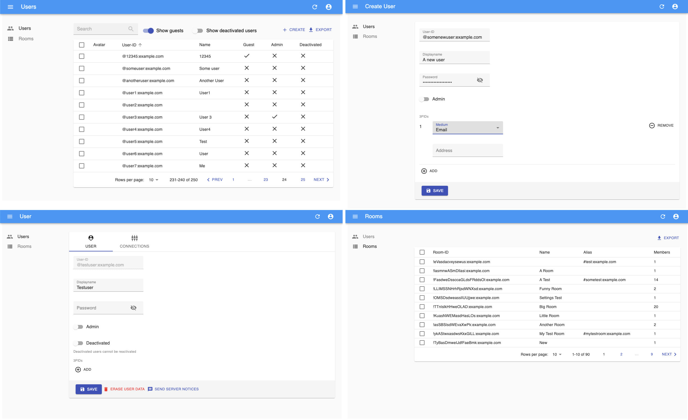

<!--
N.B.: This README was automatically generated by https://github.com/YunoHost/apps/tree/master/tools/README-generator
It shall NOT be edited by hand.
-->

# Synapse Admin pour YunoHost

[](https://dash.yunohost.org/appci/app/synapse-admin)    
[](https://install-app.yunohost.org/?app=synapse-admin)

*[Read this readme in english.](./README.md)*

> *Ce package vous permet d'installer Synapse Admin rapidement et simplement sur un serveur YunoHost.
Si vous n'avez pas YunoHost, regardez [ici](https://yunohost.org/#/install) pour savoir comment l'installer et en profiter.*

## Vue d'ensemble

Admin UI pour Synapse

**Version incluse :** 0.8.5~ynh2


## Captures d'écran



## Documentations et ressources

* Site officiel de l'app : <https://github.com/Awesome-Technologies/synapse-admin>
* Dépôt de code officiel de l'app : <https://github.com/Awesome-Technologies/synapse-admin>
* Documentation YunoHost pour cette app : <https://yunohost.org/app_synapse-admin>
* Signaler un bug : <https://github.com/YunoHost-Apps/synapse-admin_ynh/issues>

## Informations pour les développeurs

Merci de faire vos pull request sur la [branche testing](https://github.com/YunoHost-Apps/synapse-admin_ynh/tree/testing).

Pour essayer la branche testing, procédez comme suit.

``` bash
sudo yunohost app install https://github.com/YunoHost-Apps/synapse-admin_ynh/tree/testing --debug
ou
sudo yunohost app upgrade synapse-admin -u https://github.com/YunoHost-Apps/synapse-admin_ynh/tree/testing --debug
```

**Plus d'infos sur le packaging d'applications :** <https://yunohost.org/packaging_apps>
